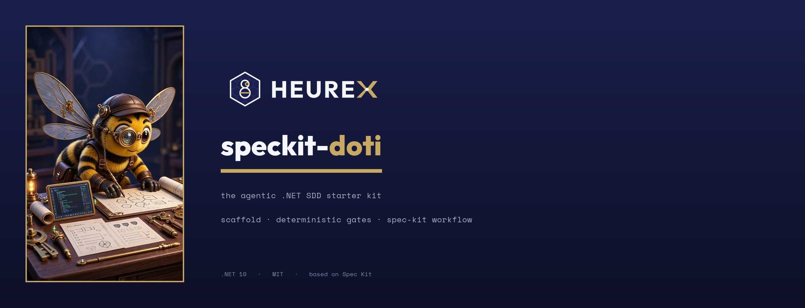

<div align="center">



# speckit-doti

**A .NET starter kit for spec-driven development with AI coding agents.**

`dotnet new hx-dotnet-cli` scaffolds a complete, **compiling** .NET 10 solution — pure domain library + agent-first CLI + unit & [ArchUnitNET](https://github.com/TNG/ArchUnitNET) architecture tests + dual-engine architecture gating — **and installs a deterministic, command-enforced workflow** (doti) based on [GitHub Spec Kit](https://github.com/github/spec-kit). Your AI agent (Claude Code, Codex) then builds inside guardrails that won't let it skip a step or commit unverified work.

[](https://dotnet.microsoft.com/)
[](LICENSE)
[](https://github.com/github/spec-kit)
[-C9A961?style=flat-square&labelColor=1A1F4D)](https://github.com/heurexai/sentrux)

</div>

---

## Why .NET devs use it

- **One command, a project that builds.** `dotnet new hx-dotnet-cli` emits a layered .NET 10 solution — domain library, agent-first CLI, xUnit tests, ArchUnitNET architecture tests, security analyzers, gate configs — that compiles and tests **green on day one**. No wiring, no "TODO: add tests later."
- **Architecture rules that fail the build.** Eight [ArchUnitNET](https://github.com/TNG/ArchUnitNET) families + a vendored [Sentrux](https://github.com/heurexai/sentrux) boundary engine run on every `dotnet test`. Layering drift is a red build, not a code-review nit.
- **Guardrails your agent can't talk its way around.** Unlike Spec Kit's advisory markdown prompts, every doti stage is backed by a CLI command that emits a hash-bound proof, and the gate ladder is **fail-closed** — a commit chokepoint refuses work it didn't verify.
- **Agent-first by design.** Every operation is a JSON-first command, so Claude Code or Codex can drive, verify, and report on the whole spec → ship loop with no human in the path.

## 30-second quickstart

```bash
# scaffold a new agent-first .NET solution (doti is installed automatically)
dotnet run --project tools/Hx.Scaffold.Cli -- new \
  --name Acme.Widget --output ./Acme.Widget --company Acme --agents codex,claude

# it builds and tests green immediately
dotnet build ./Acme.Widget/Acme.Widget.slnx -c Release
dotnet test  ./Acme.Widget/Acme.Widget.slnx -c Release
```

Then point your agent at the slash-commands and let the gates do the enforcing:

```
/doti-specify → /doti-clarify → /doti-plan → /doti-tasks → /doti-analyze
→ /doti-arch-review → /doti-implement → /doti-drift-review → /doti-commit → /doti-release
```

Full setup (build the toolkit, install hooks, run the gate) is in [Get started](#get-started).

---

## Table of contents

- [What is speckit-doti?](#what-is-speckit-doti)
- [Why we built this](#why-we-built-this)
- [The scaffold (the starter kit)](#the-scaffold-the-starter-kit)
  - [What `dotnet new` generates](#what-dotnet-new-generates)
  - [The generated project's architecture](#the-generated-projects-architecture)
  - [The toolkit's own architecture](#the-toolkits-own-architecture)
- [The doti workflow](#the-doti-workflow)
- [Sentrux — our fork](#sentrux--our-fork)
- [Customise it to your process](#customise-it-to-your-process)
- [Get started](#get-started)
- [CLI reference](#cli-reference)
- [The deterministic gate](#the-deterministic-gate)
- [Status](#status)
- [Acknowledgements](#acknowledgements)
- [Contributing and support](#contributing-and-support)
- [License](#license)

---

## What is speckit-doti?

It's two things in one repo, and **the scaffold (the starter kit) is the headline**:

1. **A scaffold / `dotnet new` template.** `dotnet new hx-dotnet-cli` (or `Hx.Scaffold.Cli new`) generates a ready-to-build .NET 10 solution — a pure domain library, an agent-first CLI, xUnit tests, ArchUnitNET architecture tests, build-time security analyzers, and the rules/configs for the gate — **and installs the doti workflow into it**. It compiles and tests green on day one.

2. **A workflow.** doti is a Spec Kit-based, spec-driven development process (`specify → … → commit → release`) where every stage emits a command-backed, hash-bound proof and the gate ladder is fail-closed. It rides on top of whatever the scaffold generated.

In short: **speckit-doti is the starter kit; doti is the process it installs.** You get a project that builds immediately and is wired for an AI coding agent to develop it safely — spec-first, architecture-gated, and unable to commit work it didn't verify.

## Why we built this

[GitHub Spec Kit](https://github.com/github/spec-kit) showed that **specify → plan → tasks → implement**, driven by an AI agent, beats vibe-coding. We use it and believe in it. But two gaps stopped us shipping real .NET work with it.

### vs. plain Spec Kit — the workflow is *enforced*, not suggested

Spec Kit's commands are markdown prompts and its quality checks are prose. Nothing stops an agent — working largely unattended — from skipping clarification, ignoring the plan, or committing unverified work. **"The prompt told it to" is not "the tooling made it."** doti backs every stage with a deterministic CLI command and a hash-bound proof, and makes commit a fail-closed chokepoint. (Full comparison: [doti vs Spec Kit](#doti-vs-spec-kit).)

### vs. "just use an AI assistant" — guardrails are the answer

Handing a capable agent a `.csproj` and hoping is how you get plausible code that quietly violates your architecture, drops the test it couldn't make pass, and commits anyway. speckit-doti replaces hope with **enforcement**: architecture tests that fail the build, a deterministic gate ladder, and a commit path that re-verifies a fresh passing proof before anything lands. The agent moves fast *inside* boundaries it cannot cross.

There was also **no opinionated, _compiling_ .NET starting point** that bakes the workflow, the architecture rules, and the gates into a project you can build on the first commit. speckit-doti is that starting point — and it takes an opinionated stance on three things Spec Kit leaves to judgement:

1. **Process** — the cycle is *stamped and checked*, not suggested.
2. **Architecture & design** — declared boundaries are *gated* on every change, by two engines.
3. **A comprehensive, agent-first CLI** — every operation is a JSON-first command, so an *agent* can drive, verify, and report on the whole loop with no human in the path.

---

## The scaffold (the starter kit)

This is where most of the value lives.

### What `dotnet new` generates

```bash
dotnet run --project tools/Hx.Scaffold.Cli -- new \
  --name Acme.Widget --output ./Acme.Widget --company Acme --agents codex,claude
```

produces a complete, buildable solution **and installs doti into it**:

```
Acme.Widget/
├─ src/
│  ├─ Acme.Widget/                      # domain library — pure, no CLI/IO/network deps
│  └─ Acme.Widget.Cli/                  # agent-first CLI — Program + the Agent host
├─ test/
│  ├─ Acme.Widget.Tests/               # unit tests (xUnit v3)
│  └─ Acme.Widget.Architecture.Tests/  # ArchUnitNET architecture gates
├─ rules/                               # architecture / hygiene / security / sentrux contracts
├─ .sentrux/                            # Sentrux boundary config
├─ .doti/ + agent skill files           # the doti workflow, installed for codex/claude
├─ global.json                          # SDK pin
└─ Acme.Widget.slnx
```

```bash
dotnet build Acme.Widget.slnx -c Release   # green
dotnet test  Acme.Widget.slnx -c Release   # unit + architecture tests pass
```

The template is registered as **`hx-dotnet-cli`** ("Heurex .NET CLI scaffold — library + CLI + tests"). `--agents` controls which agents' skill files are rendered.

### The generated project's architecture

The point of the scaffold is that good design is **enforced from the first commit**, not aspired to:

- **Layered & dependency-directed.** A pure domain `library` that may depend on nothing, and a `CLI` that may depend only on the library — enforced by tests, not just documented.
- **Agent-first CLI.** Commands return a `CliResult` envelope — _Status / Identity / Diagnostics / Direction / Result_, plus _Effects / Progress_ — serialized as LF-normalized, JSON-first output. A single `Agent` host is the only type allowed to write to the console, so output is one machine-consumable chokepoint. Structured error codes (`<PREFIX><NNNN>`), a `describe` command for self-description, and NDJSON streaming come built in.
- **Architecture gated by code.** `test/*.Architecture.Tests` runs **eight ArchUnitNET families** on every `dotnet test`:

  | family | enforces |
  | --- | --- |
  | `namespaceDependency` | the library must not depend on the CLI |
  | `classDependency` | the library must not depend on the System.CommandLine framework |
  | `inheritanceNaming` | service implementations are named `*Service` |
  | `classNamespaceContainment` | `*Service` types live in the library namespace |
  | `attributeAccess` | `[SerializableContract]` DTOs live in the library, not the CLI |
  | `cycle` | namespaces are free of dependency cycles |
  | `capabilityConfinement` | the library must not touch process execution, networking, or dynamic code generation (least privilege) |
  | `outputConfinement` | only the `Agent` host writes to the console (output stays JSON-first) |

- **Security at the build.** .NET analyzer security rules (CA3xxx/CA5xxx) are errors via `Directory.Build.props` — the build itself is the SAST gate.

### The toolkit's own architecture

The repo that produces all of the above is itself a layered .NET 10 solution (and it dog-foods doti):

- **`Hx.Cli.Kernel`** — the agent-first CLI kernel (the `CliResult` envelope, the JSON writer, the error-code registry + stability check, `describe`) shared by every tool *and* the template.
- **`Hx.Tooling.Contracts`** — shared contracts.
- **Engine cores** (no console/IO concerns): `Hx.Scaffold.Core` (generation, vendoring, doti install), `Hx.Doti.Core` (renders skills from one source), `Hx.Cycle.Core` (cycle-state proofs), `Hx.Gate.Core` (the ladder + `GateProof`), `Hx.Impact.Core` (affected-test planning), `Hx.Sentrux.Core`, `Hx.Security.Core`, `Hx.Version.Core`, `Hx.Runner.Core`.
- **Thin CLIs**: `Hx.Runner.Cli` (the workhorse — gate / architecture / sentrux / hygiene / version / security / doti), `Hx.Impact.Cli` (`plan`), `Hx.Scaffold.Cli` (`new`).
- **`scaffold/`** — the `hx-dotnet-cli` template pack.
- **`tools/{gitleaks,sentrux,gitversion}`** — vendored, pinned, SHA-256-verified binaries.

---

## The doti workflow

doti is the process layer the scaffold installs. It ships as slash-command skills (Claude: `/doti-specify`; the same skills render for Codex). **Always start with `specify` and run them in order** — each stage's proof is a prerequisite for the next, and `doti cycle check` enforces that chain fail-closed.


<sub>Gold-bordered stages are **doti-only** — no Spec Kit equivalent. The rest map to Spec Kit commands.</sub>

### doti vs Spec Kit

|                    | GitHub Spec Kit                          | doti (in speckit-doti)                             |
| ------------------ | ---------------------------------------- | -------------------------------------------------- |
| Delivery           | Python CLI that bootstraps templates     | A .NET scaffold that generates a compiling project |
| Commands           | Markdown prompts the agent should follow | Prompts **backed by** deterministic CLI tools      |
| Quality checks     | Advisory prose                           | Fail-closed gates that block the build / commit    |
| Process state      | Implicit                                 | Explicit, hash-bound stage proofs + freshness      |
| Commit             | Up to the agent                          | A chokepoint that refuses unverified work          |
| Architecture       | Out of scope                             | First-class, dual-engine, gated on every change    |

We kept what makes Spec Kit good — the spec-first sequence, clarification before planning, cross-artifact analysis — and built the enforcement layer underneath it.

### The stages

> **Constitution (not a command).** doti keeps project principles in `doti/core/memory/constitution.md`, referenced by the plan and analyze stages. _Spec Kit equivalent:_ `/speckit.constitution` — doti's is a static, version-controlled document instead of a generative command, so the principles are a stable input rather than something regenerated each run.

1. **`/doti-specify`** — Author the feature spec → `docs/specs/{feature}.md`.
   _Spec Kit:_ `/speckit.specify`. Same role; doti hash-stamps the stage so later stages can detect if the spec shifted underneath them.

2. **`/doti-clarify`** — Resolve ambiguities by asking blocking questions one at a time, folding each answer into `## Clarifications`.
   _Spec Kit:_ `/speckit.clarify`. Same intent; doti additionally enforces a fixed **operator-question format** (Context / Why it matters / Options / Recommendation / Assumptions / Confidence) with an evidence requirement.

3. **`/doti-plan`** — Produce the implementation plan → `docs/plans/{feature}-plan.md`.
   _Spec Kit:_ `/speckit.plan`. Same role; the plan is a hash-bound artifact in the cycle.

4. **`/doti-tasks`** — Break the plan into executable tasks → `docs/tasks/{feature}-tasks.md`.
   _Spec Kit:_ `/speckit.tasks`. Same role. (No `taskstoissues` equivalent — tasks stay local and gated.)

5. **`/doti-analyze`** — Cross-artifact consistency and coverage review across spec / plan / tasks.
   _Spec Kit:_ `/speckit.analyze`. Same intent.

6. **`/doti-arch-review`** — _(doti-only)_ Review the architecture impact and verify the ArchUnitNET + Sentrux configs actually measure the intended boundaries — **before any code is written**.
   _Spec Kit:_ no equivalent.

7. **`/doti-implement`** — Execute the tasks.
   _Spec Kit:_ `/speckit.implement`. Same role; doti attaches an explicit engineering-discipline contract (root-cause not symptom, prove every claim, no silenced checks, a 95%-confidence bar).

8. **`/doti-drift-review`** — _(doti-only)_ Compare the actual diff against the approved plan/design and check for drift between source assets and installed files.
   _Spec Kit:_ loosely related to `/speckit.converge`, but it's a **gate** that catches divergence before you can commit, not a task-appender.

9. **`/doti-commit`** — _(doti-only)_ Make the scoped commit through the sanctioned path. `doti cycle commit` refuses unless a fresh drift-review, a fresh passing `gate run` proof, and a clean staged scope all line up.
   _Spec Kit:_ no equivalent.

10. **`/doti-release`** — _(doti-only)_ Cut a version via the GitVersion-backed release lane (calculate → bump → annotated tag), running the gate at the `release` profile.
    _Spec Kit:_ no equivalent.

> Spec Kit's `/speckit.checklist` has no dedicated doti command — doti folds completeness / clarity / consistency checking into `/doti-analyze` and the gate.

---

## Sentrux — our fork

doti's architecture gate runs on **two** independent engines: [ArchUnitNET](https://github.com/TNG/ArchUnitNET) (in-code rules) and [Sentrux](https://github.com/heurexai/sentrux) (a boundary/quality sensor for AI agents). We maintain a **fork** — [github.com/heurexai/sentrux](https://github.com/heurexai/sentrux) — because the scaffold needs .NET/C#-aware analysis that upstream didn't provide:

- **.NET project-reference edges** — `<ProjectReference>` entries feed the dependency graph.
- **C# type dependency edges** — type-level dependencies inferred from C# source.
- **`.sentruxignore`** — gitignore-syntax exclusions that apply **even to git-tracked files**, so generated `scaffold/templates/` content is kept out of the scan.
- **Cycle edge diagnostics** — per-cycle edge chains pinpoint the exact imports forming each dependency cycle.
- **Fork build identity** — an embedded Windows version resource; the gate verifies the binary reports `Heurex fork`.

The fork is MIT-licensed, released at [heurexai/sentrux/releases](https://github.com/heurexai/sentrux/releases), and **vendored here pinned + SHA-256-verified** (win-x64; the binary is fetched operationally and gitignored to keep the repo lean). `sentrux verify` checks the manifest, hash, grammar, and fork identity before the gate runs.

---

## Customise it to your process

doti is single-sourced and configurable — adapt it to your team without forking the toolkit:

- **The workflow / skills** — edit `doti/core/skills.json` (stage names, intents, next-stage hints, the operator-question protocol) and re-render with `doti render-skills`. Installed skill files are generated — don't hand-edit them.
- **The stage model** — `doti/core/workflows/doti/workflow.yml` defines stage order, the artifact each stage `produces`, and prerequisites.
- **Architecture rules** — edit a project's `rules/architecture.json` + its ArchUnitNET tests, and `.sentrux/rules.toml` (layers / boundaries / constraints) for the Sentrux engine.
- **Gate strictness** — `gate run --profile <auto|advisory|normal|release>` tunes the ladder per context (dev vs release).
- **Principles** — `doti/core/memory/constitution.md` holds the governing principles the plan/analyze stages read.
- **Agents** — `--agents codex,claude` renders the workflow for the agents you actually use.

---

## Get started

**Prerequisites:** [.NET 10 SDK](https://dotnet.microsoft.com/) (10.0.300+), Git, and PowerShell or bash. Vendored tools (Gitleaks, Sentrux, GitVersion) are pinned and SHA-256-verified per their manifests under `tools/`, and fetched operationally — the large binaries are gitignored.

```bash
# 1. build + test the toolkit itself
dotnet build scaffold-dotnet.slnx -c Release
dotnet test  scaffold-dotnet.slnx -c Release

# 2. scaffold a new agent-first .NET solution (doti is installed automatically)
dotnet run --project tools/Hx.Scaffold.Cli -- new \
  --name Acme.Widget --output ./Acme.Widget --company Acme --agents codex,claude

# 3. (optional) install the insurance pre-commit hook in the new repo
dotnet run --project tools/Hx.Runner.Cli -- doti install-hooks --repo ./Acme.Widget

# 4. run the deterministic gate
dotnet run --project tools/Hx.Runner.Cli -- gate run --repo ./Acme.Widget --profile auto --json
```

Then drive development with the slash-commands, in order — each stage's proof is a prerequisite for the next:

```
/doti-specify → /doti-clarify → /doti-plan → /doti-tasks → /doti-analyze
→ /doti-arch-review → /doti-implement → /doti-drift-review → /doti-commit → /doti-release
```

## CLI reference

Every command is `dotnet run --project tools/Hx.Runner.Cli -- <command>` (use `Hx.Impact.Cli` for `plan`, `Hx.Scaffold.Cli` for `new`). Add `--json` for the machine envelope.

| Command | What it does |
| --- | --- |
| `new` _(Hx.Scaffold.Cli)_ | Generate a new agent-first .NET solution and install doti |
| `gate run --profile <auto\|advisory\|normal\|release>` | Run the full deterministic gate ladder → one fail-closed `GateProof` |
| `security scan` | Package-vulnerability SCA (`dotnet list package --vulnerable`) + analyzer SAST status |
| `architecture test` | ArchUnitNET per-family proof |
| `sentrux verify` / `sentrux check` | Verify the vendored Sentrux binary / run the boundary analysis |
| `hygiene scan` / `hygiene gitleaks verify` | Working-tree hygiene + secret scanning |
| `version calculate` / `version bump` | GitVersion semantic version / bump + annotated tag |
| `tools fetch [--rid] [--tool all\|gitleaks\|sentrux\|gitversion]` | Download + SHA-256-verify the vendored tool binaries from their pinned manifests (fail-closed on mismatch) |
| `plan` _(Hx.Impact.Cli)_ | Affected-test planner (project-graph reverse closure → covering test projects) |
| `doti cycle stamp \| status \| check \| commit` | Stamp a stage / show cycle state / fail-closed prereq check / sanctioned commit |
| `doti question check` | Validate operator-question format compliance |
| `doti render-skills` / `doti install` / `doti install-hooks` | Re-render skills / install the workflow / install the pre-commit hook |
| `describe` | Self-describe the CLI surface as JSON |

## The deterministic gate

`gate run` aggregates an ordered, fail-closed ladder into one change-set-bound `GateProof`:

1. **Hygiene** — working-tree / staged scope checks
2. **Secret scanning** — vendored [Gitleaks](https://github.com/gitleaks/gitleaks)
3. **Architecture** — [ArchUnitNET](https://github.com/TNG/ArchUnitNET) families + [Sentrux](https://github.com/heurexai/sentrux) boundary analysis
4. **Affected-test planning** — project-graph reverse closure scopes the `normal`/`advisory` test run; `release` runs the full suite
5. **Build & test**
6. **Security** — package-vulnerability SCA + build-integrated analyzer SAST (CA3xxx/CA5xxx as errors); enforced at `release`, advisory in dev
7. **Versioning** — [GitVersion](https://github.com/GitTools/GitVersion)

The gate never creates a Sentrux baseline, and persists its proof so `doti cycle commit` can require a _fresh, passing_ one.

## Status

Fully green on **win-x64**; other RIDs fail closed pending cross-platform vendoring of the binary tools (Gitleaks / Sentrux / GitVersion). The vendored tools self-provision: `tools fetch` downloads + SHA-256-verifies each tool binary (incl. GitVersion) from its pinned manifest, fail-closed on mismatch, and `new` runs it best-effort so a generated project ends up with a working GitVersion (plus Gitleaks / Sentrux) without a manual step. Cross-platform CI is on the roadmap.

## Acknowledgements

- **[GitHub Spec Kit](https://github.com/github/spec-kit)** — speckit-doti is **based on Spec Kit**'s spec-driven development workflow and command model; we adapted its `specify → clarify → plan → tasks → analyze → implement` sequence to .NET and added the deterministic enforcement, the scaffold, and the architecture gating. Spec Kit is itself influenced by the work and research of John Lam.
- **[Sentrux (Heurex fork)](https://github.com/heurexai/sentrux)** — architecture & boundary analysis engine; forked to add .NET/C#-aware dependency analysis (see [Sentrux — our fork](#sentrux--our-fork)). MIT.
- **[ArchUnitNET](https://github.com/TNG/ArchUnitNET)** by TNG — in-code structural architecture rules.
- **[Gitleaks](https://github.com/gitleaks/gitleaks)** — secret scanning (vendored).
- **[GitVersion](https://github.com/GitTools/GitVersion)** — semantic versioning from git history (vendored).
- **[System.CommandLine](https://github.com/dotnet/command-line-api)** — the parser behind the agent-first kernel.
- **[xUnit](https://github.com/xunit/xunit)** — the test framework.

## Contributing and support

Contributions are welcome under the MIT license and DCO sign-off. Start with [CONTRIBUTING.md](CONTRIBUTING.md), use [SUPPORT.md](SUPPORT.md) for help, follow the [Code of Conduct](CODE_OF_CONDUCT.md), and report security-sensitive issues through [SECURITY.md](SECURITY.md).

## License

Licensed under the [MIT License](LICENSE). Copyright (c) 2026 Heurex.
